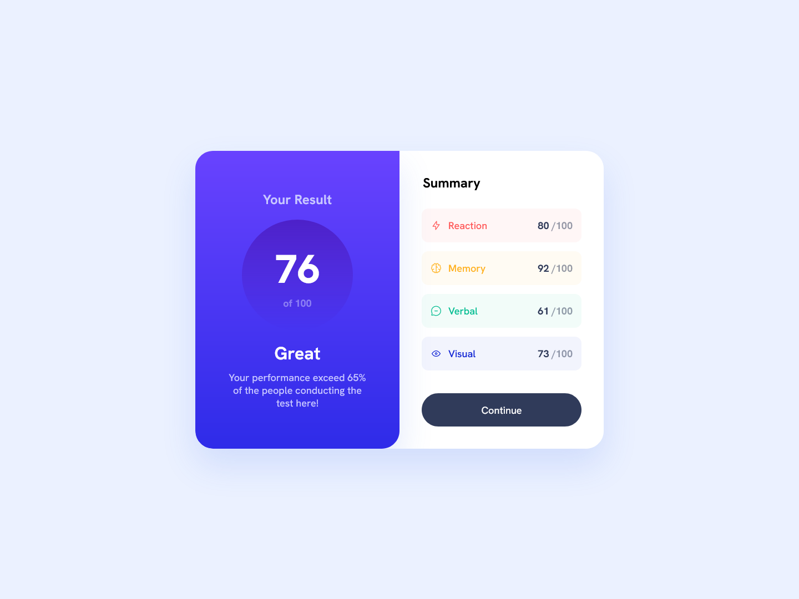
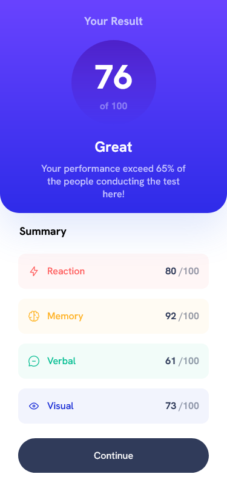

# Frontend Mentor - Results summary component solution

This is a solution to the [Results summary component challenge on Frontend Mentor](https://www.frontendmentor.io/challenges/results-summary-component-CE_K6s0maV). Frontend Mentor challenges help you improve your coding skills by building realistic projects. 

## Table of contents

- [Overview](#overview)
  - [The challenge](#the-challenge)
  - [Screenshot](#screenshot)
  - [Links](#links)
- [My process](#my-process)
  - [Built with](#built-with)
- [Author](#author)
- [Acknowledgments](#acknowledgments)

## Overview

### The challenge

Users should be able to:

- View the optimal layout for the interface depending on their device's screen size
- See hover and focus states for all interactive elements on the page

### Screenshot

#### Desktop View:

#### Mobile View:

### Links

- [Solution URL](https://www.frontendmentor.io/solutions/results-summary-solution-zqylSojYgE)
- [Live Site URL](https://earthyy-results-summary.netlify.app/)

## My process

### Built with

- Semantic HTML5 markup
- CSS custom properties
- Flexbox
- CSS Grid
- Mobile-first workflow

## Author

- Frontend Mentor - [@Earthyyy](https://www.frontendmentor.io/profile/Earthyyy)
- Github - [@Earthyy](https://github.com/Earthyyy)

## Acknowledgments

Big Thanks <3 to :

* [Kevin Powell](https://www.youtube.com/@KevinPowell)
* [Codecademy](https://www.codecademy.com)
* [Frontend Mentor](https://www.frontendmentor.io/) 
